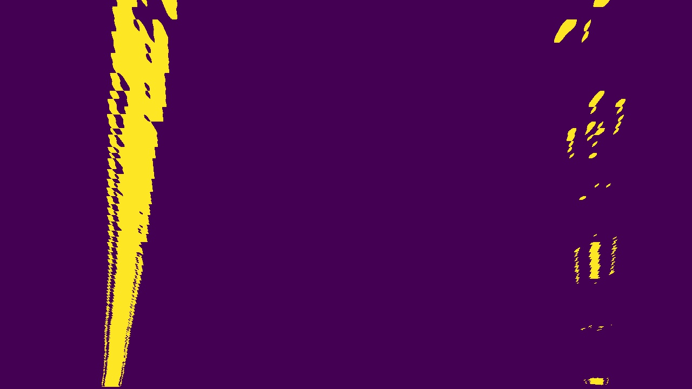
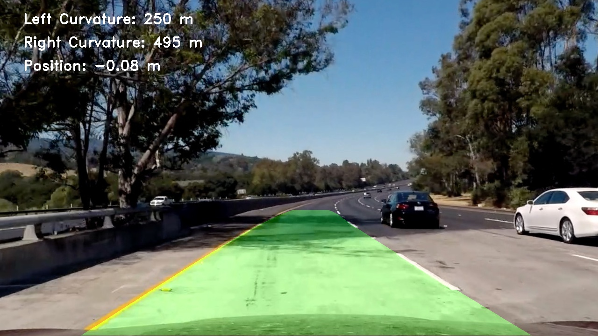

## Writeup Template

### You can use this file as a template for your writeup if you want to submit it as a markdown file, but feel free to use some other method and submit a pdf if you prefer.

---

**Advanced Lane Finding Project**

The goals / steps of this project are the following:

* Compute the camera calibration matrix and distortion coefficients given a set of chessboard images.
* Apply a distortion correction to raw images.
* Use color transforms, gradients, etc., to create a thresholded binary image.
* Apply a perspective transform to rectify binary image ("birds-eye view").
* Detect lane pixels and fit to find the lane boundary.
* Determine the curvature of the lane and vehicle position with respect to center.
* Warp the detected lane boundaries back onto the original image.
* Output visual display of the lane boundaries and numerical estimation of lane curvature and vehicle position.


## [Rubric](https://review.udacity.com/#!/rubrics/571/view) Points

### Here I will consider the rubric points individually and describe how I addressed each point in my implementation.  

---

### Writeup / README

#### 1. Provide a Writeup / README that includes all the rubric points and how you addressed each one.  You can submit your writeup as markdown or pdf.  [Here](https://github.com/udacity/CarND-Advanced-Lane-Lines/blob/master/writeup_template.md) is a template writeup for this project you can use as a guide and a starting point.  

You're reading it!

### Camera Calibration

#### 1. Briefly state how you computed the camera matrix and distortion coefficients. Provide an example of a distortion corrected calibration image.

The code for this step is located in a file called `calibrate_camera.py` and is marked in the `Advanced_Lane_Finding_Notebook.ipynb` notebook.  I read in 20 checkboard pictures taken by the camera.  Using cv2 I find the object points and image points.  From the these I use an image to find the coeffecients for undistorting the camera pictures.

### Pipeline (single images)

#### 1. Provide an example of a distortion-corrected image.

To demonstrate this step, I will describe how I apply the distortion correction to one of the test images like this one:


#### 2. Describe how (and identify where in your code) you used color transforms, gradients or other methods to create a thresholded binary image.  Provide an example of a binary image result.

I used a combination of color and gradient thresholds and HLS color space to generate a binary image (the pipeline is found in  `image_pipeline.py`).  Here's an example of my output for this step.


#### 3. Describe how (and identify where in your code) you performed a perspective transform and provide an example of a transformed image.

The code for my perspective transform includes a function called `warp()` along with it's inverse `inverse_perspective_transform()`. My source and destination points are below.  I picked the test image `straight_lines1.jpg` and tried to line up the 4 points on the road.

```python
src = np.float32([
    [590, 450],
    [685, 450],
    [260, 680],
    [1050, 680]
])

dst = np.float32([
    [260, 0],
    [1050, 0],
    [260, 720],
    [1050, 720],
])
```
Here's a picture of the points placed on the `straight_lines1.jpg` image and that's been warped:



#### 4. Describe how (and identify where in your code) you identified lane-line pixels and fit their positions with a polynomial?

I identify lane-line pixels by first running the image through the image pipeline.  Then I warp the image to get a 'bird's eye view' of the road.  Using a histogram the peaks identify lanes.  If the number of pixes are not met at the peaks then I mostly likely did not find the lane.

Using the "Sliding Window Method" I work my way up the image within a window and then generating a line of best fit found within all the "windows".

If my lanes were already found I can skip the sliding window approach and just use the line of best fit to find pixel data that contains the lanes within a certain margin.

![alt text][image5]

#### 5. Describe how (and identify where in your code) you calculated the radius of curvature of the lane and the position of the vehicle with respect to center.

I have a function for line curvature in the jupyter notebook (`line_curvature(ploty, left_fitx, right_fitx)`).  It converts pixel space to real space in meters.

```
ym_per_pix = 30/720 # meters per pixel in y dimension
xm_per_pix = 3.7/700 # meters per pixel in x dimension
```

Using the above conversions we can convert the pixels line fits to real space fits and then use the curvature formulas given by Udacity.

#### 6. Provide an example image of your result plotted back down onto the road such that the lane area is identified clearly.

Taking the original image passing it through the image pipeline which undistorts the image and runs it through all the filters and running through the sliding window approach we get the lines of best fit.  Using the `draw_poly` method we can convert it all back to the original image by the inverse perspective transform (Minv).

Here is an example of my result on a test image:



---

### Pipeline (video)

#### 1. Provide a link to your final video output.  Your pipeline should perform reasonably well on the entire project video (wobbly lines are ok but no catastrophic failures that would cause the car to drive off the road!).

Here's a [link to my video result](./videos/project_video.mp4)

---

### Discussion

#### 1. Briefly discuss any problems / issues you faced in your implementation of this project.  Where will your pipeline likely fail?  What could you do to make it more robust?

The pipeline will start to fail when there's no lines present for a while.  Also, lines similar to road color and shadows may start a problem.  A more robust lane finding method maybe used.  Such as using RGB color spaces.  For example using the Red colorspace could help.
